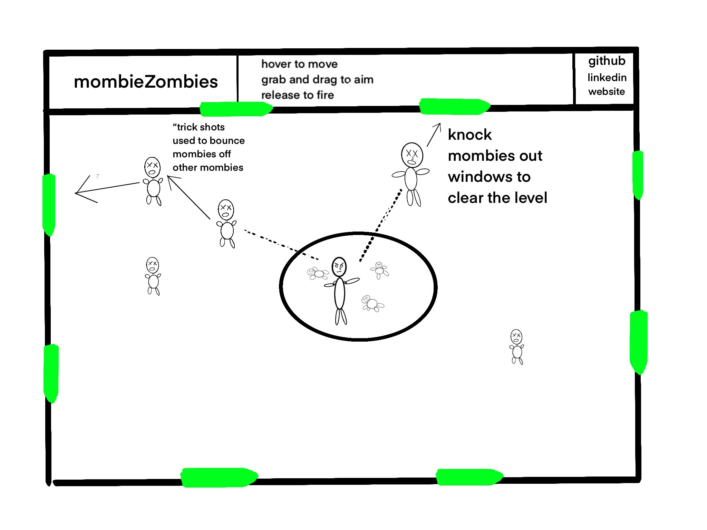

# [mombieZombies](https://elpopes.github.io/mombieZombies/)

A browser-based zombie shoving game utilizing canvas to fight off the zombie apocalypse one mom at a time.

# background

Who is going to guard against the guardians? It's pickup time at the daycare, but there was a whole zombie infestation since dropoff and it's your job to keep zombie parents from picking up their kids. A mix between a top down zombie shooter and pool, where you use the mouse to knock "mombies" through windows and doors to clear levels which get progressively more difficult.

If the mombies succeed in picking up their kids or if they touch you, the game is over.

# functionality & MVPs

In mombiezombies, players will be able to:

- use hover to move their sprite around a rectangular room.
- drag the mouse to aim, release to fire
- control the velocity and direction of their projectile
- use their projectile to bounce mombies off each other and out windows

# additionally, this game will include:

- a brief overlay to explain the game mechanics
- a dynamic header with the game name, developer links and simple instructions

# wireframe

- dynamic room that changes aspect ratio and size to fit the browser window.
- nav bar includes relevant links and brief instructions
- collision detection keeps the zombies in the room unless they go out the windows

# technologies, libraries and APIs

- Canvas API to render gameplay
- Webpack to bundle and transpile
- NPM to manage dependencies for the project

# Implementation

- thursday: complete project proposal, research collision detection and object rendering in canvas.
- friday: complete project setup, including webpack and folder structure.
- saturday: complete build of the dynamic room. research sprites and experiment.
- sunday: focus on collision detection and mombie movement.
- monday: complete mombie generation for level one. Mombie should enter randomly into room from one of four doors. Switch focus to firing mechanics and physics, velocity should vary depending on "charge time" and pull distance.
- tuesday: complete firing mechanism and player movement with mouse. Generate multiple zombies.
- wednesday: complete collision detection and bouncing. import sprite
- thursday: seriously though, complete collision detection and mombie bouncing. Complete nav bar and finalize look.
- friday: deploy!
